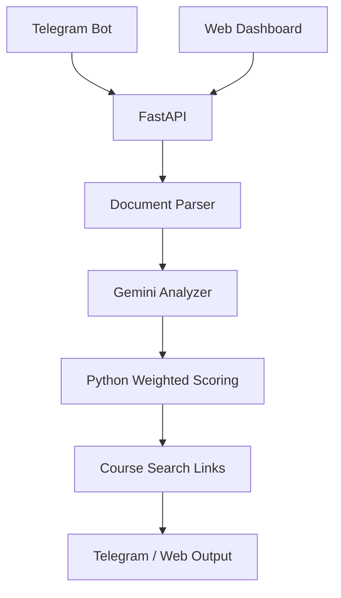

# HireLens AI

**Know how well your resume matches the job.**

Explainable Job Description × Resume alignment through a Telegram assistant (and a local dashboard). This is **alignment analysis**, not a hiring decision and not an honesty detector.

## Problem

Recruiters and candidates spend too long comparing resumes to JDs by hand. Skill gaps, experience mismatches, and weak evidence (skills listed but never shown in projects) get missed.

## Solution

HireLens accepts a JD plus one or many resumes (PDF / DOCX / TXT), extracts text, asks Gemini for structured component scores, then **computes the final score in Python** with a published formula. Output is short and recruiter-friendly: score, matched/missing skills, evidence confidence, a 2–4 line suggestion, and at most 4 course-search links.

## Features

- Telegram bot with inline buttons: single resume, multiple resumes, help
- Transparent compatibility score (not a free-form LLM number)
- Evidence confidence: Strong / Moderate / Weak / Not Found — never “lying”
- “Why this score?” breakdown
- Max 4 Coursera search links for missing skills
- Local FastAPI dashboard with drag-and-drop style file inputs and score gauges

## Architecture



## Tech stack

| Layer | Choice |
| --- | --- |
| Chat | Telegram Bot API (`python-telegram-bot`) |
| API | FastAPI + Uvicorn |
| LLM | Gemini (`GEMINI_API_KEY`, `MODEL_NAME`) |
| Parse | pypdf, python-docx, TXT |
| Score | Python weights |
| UI | HTML / CSS / JS |
| Storage | In-memory session dict only |

## Installation

```powershell
cd "C:\Users\RanjithKumar\OneDrive\Desktop\chatbot cursor"
python -m venv .venv
.\.venv\Scripts\Activate.ps1
pip install -r requirements.txt
```

## Environment variables

Copy `.env.example` to `.env` (already present) and fill:

| Variable | Purpose |
| --- | --- |
| `TELEGRAM_BOT_TOKEN` | From [@BotFather](https://t.me/BotFather) |
| `GEMINI_API_KEY` | Google AI Studio key |
| `MODEL_NAME` | Default `gemini-2.0-flash` |
| `MAX_FILE_SIZE_MB` | Upload cap (default 8) |

Never commit real tokens.

## Telegram bot setup

1. Open Telegram → [@BotFather](https://t.me/BotFather)
2. `/newbot` → name `HireLens AI` → username e.g. `hirelens_ai_bot`
3. Paste the token into `.env` as `TELEGRAM_BOT_TOKEN=...`
4. Get a Gemini key from [Google AI Studio](https://aistudio.google.com/apikey) → `GEMINI_API_KEY=...`

## Running locally

Dashboard only:

```powershell
python run.py --api
```

Open http://127.0.0.1:8080

Telegram only:

```powershell
python run.py --bot
```

Both (API in a background thread, then bot polling):

```powershell
python run.py
```

## API endpoints

| Method | Path | Use |
| --- | --- | --- |
| GET | `/` | Dashboard |
| GET | `/health` | Liveness |
| POST | `/api/analyze` | One JD + one resume (`jd` file or `jd_text`, `resume` file) |
| POST | `/api/analyze-multiple` | One JD + many `resumes` |

## Score formula

```
final = 40% skill_match
      + 25% experience_match
      + 15% education_match
      + 10% project_match
      + 10% requirement_coverage
```

The model scores each component 0–100. Python applies the weights.

## Example output (Telegram)

```
🎯 JD-RESUME ALIGNMENT
Compatibility: 78%
✅ Matched Skills: Python, SQL, ML, Git
❌ Missing Skills: AWS, Docker
🔎 Evidence: Python — Strong; AWS — Weak
💡 Suggestion: Good technical alignment, missing cloud/deploy proof.
📚 Learn Next: Coursera search links (max 4)
```

## Future improvements

- Persist sessions only with explicit user consent
- Official course catalog IDs instead of search URLs
- Batch recruiter workspace
- Optional local embedding pre-filter before the LLM call

## Demo script (5 minutes)

1. `/start` in Telegram → Analyze Multiple Resumes  
2. Paste a real JD  
3. Upload a strong resume PDF, then a weak one  
4. `/done` — show the score gap  
5. Tap **Why X%?** — show the weighted breakdown  
6. Open a Coursera link from Learn Next  
7. If time: open http://127.0.0.1:8080 and repeat on the dashboard
